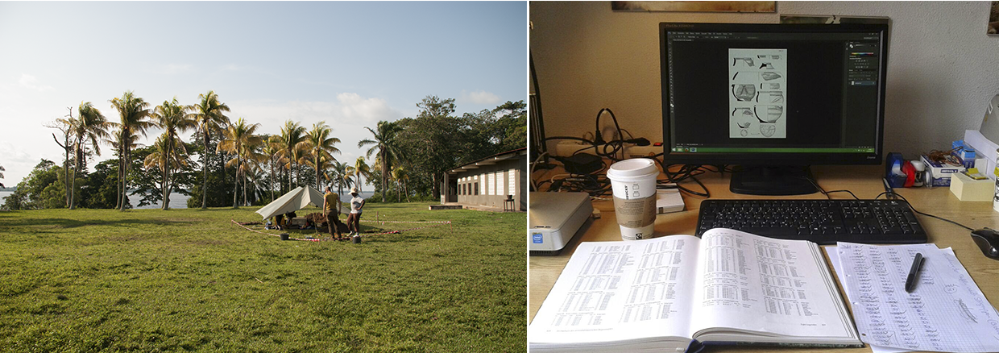

# Einleitung
## About us

\begin{columns}
\begin{column}{0.48\textwidth}
Dirk Seidensticker
\begin{itemize}
\item seit 2015: Wiss. Mitarbeiter der Forschungsstelle Afrika (Universität zu Köln)
\item seit 2012: Promotion an der Universität zu Köln
\item \textbf{Python, R, SQL}
\end{itemize}
\end{column}

\begin{column}{0.48\textwidth}
Clemens Schmid
\begin{itemize}
\item seit 2015: Masterstudium CAU Kiel
\item 20??-2015: Mitarbeit im Forschungs-Projekt "Das kupferzeitliche Gräberfeld Varna~I"
\item \textbf{R, ...}
\end{itemize}
\end{column}
\end{columns}

## Daten in der Archäologie

\centering

\begin{small}(Fotos: K. Jungnickel 2015)\end{small}

## Daten in der Informatik

* Datentypen:
    * **ordinal skalierte Daten** haben eine festgelegte Reihenfolge
        * Ganze Zahlen und Natürliche Zahlen
        * (Boolean)
    * **mononale Daten** sind diskret und zeigen eine qualitative Ausprägung eines Merkmals

## Skalenniveaus

\begin{small}(https://de.wikipedia.org/wiki/Datei:Skalenniveau.png)\end{small}

## Fragestellungen

## Reproduzierbarkeit

\centering

\begin{small}A. Azam, The first rule of data science. The Berkeley Science Review. <http://berkeleysciencereview.com/article/first-rule-data-science/> [Stand: 10. Januar 2016].\end{small}

## Vor- und Nachteile von R

\begin{columns}
\begin{column}{0.48\textwidth}
Vorteile
\begin{itemize}
\item Reproduzierbarkeit und hohe Nachnutzbarkeit
\item Skalierbarkeit
\item Erweiterbarkeit
\end{itemize}
\end{column}

\begin{column}{0.48\textwidth}
Nachteile
\begin{itemize}
\item Hohe Einstiegs-/Lernschwelle
\item Teilweise 'krude' Syntax
\end{itemize}
\end{column}
\end{columns}

