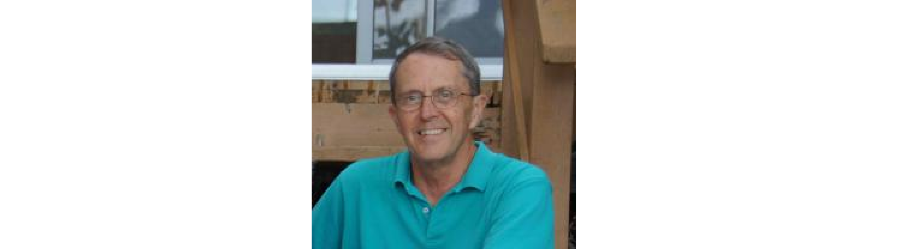

# Einführung

## Grundlagen


* R ist eine Programmiersprache zur **statistischen Datenverarbeitung und -visualisierung**

* R ist **quelloffen** (unter GNU GPL) läuft unter diversen **UNIX-**, **Linux-** und Unix-ähnlichen Betriebsystemen, sowie auf **Windows** und **Mac OS X**

* Eine große Anzahl von existierenden Zusatzpaketen (**libraries**) aus Community-Entwicklung ergänzen die R-Funktionalität - **eigene Funktionen** können unmittelbar entworfen und implementiert werden

* R kann mit anderen Programmiersprachen wie GRASS, Perl, Python, **C**, Java, **Fortran** und **JavaScript** verbunden werden

* R kann sowohl interaktiv, also im **Einzelbefehlsmodus**, als auch als **Skriptsprache** und im Batch-Modus verwendet werden

## Geschichte - S



* \underline{1969:} **John Chambers** (Bell Laboratories) veröffentlicht den ersten Entwurf einer statistischen Sprache (Chambers 1969): Geburtsstunde von **S**

* \underline{1975-1976/1980/1988:} Entwicklung von S1, S2 und schließlich S3 (kommerzielle Variante S-PLUS)

## Geschichte - R 


* \underline{1992:} **Ross Ihaka und Robert Gentleman** (Universität Auckland) entwickeln eine freie Sprache eng orientiert an S: Geburtsstunde von **R**

* \underline{1997:} Gründung des **R Development Core Team** und des **Comprehensive R Archive Network (CRAN)**

* \underline{2000:} **R 1.0** und Übernahme des Klassen- und Objektmodells aus S4

* \underline{2004/2013:} Weiterentwicklung von R: **R 2.0**, **R 3.0**

* \underline{2015:} Gründung des **R-Consortium** (Microsoft, RStudio, HP, Google, Oracle etc.)

* Aktuelle Version: **R 2.3.2** "Wooden Christmas-Tree"  

# Funktionsprinzip 

## Aspekte

* Interpreter, Compiler und GUIs

* Objekte und Funktionen

> „To understand computations in R, two slogans are helpful: Everything that exists is an object. Everything that happens is a function call.“ - John Chambers 2014

* Syntax

* Datenstrukturen

* Klassen

# Hilfefunktionen

## Hilfe - Zu einer Funktion oder einem Paket

> ?..., ??... und help(...)

**Beschreibung**

Zeigt eine Beschreibung für Pakete, Funktionen und Datensätze an oder durchsucht die Beschreibungen aller installierter Pakete.

**Beispiel**

```{r, results='hide', eval=FALSE}
# Zeige die Beschreibung für eine bestimmte Funktion,
# ein Paket oder einen Datensatz
help(plot)
?plot
?graphics::plot
?graphics

# Durchsuche alle Beschreibungen nach diesem Stichwort
??plot
```

## Hilfe - Ich möchte mich in etwas einarbeiten

> vignette() und browseVignettes()

**Beschreibung**

Zeigt eine oder alle vorhandenen Einführungsdokumentationen (Vignettes) an. 

**Beispiel**

```{r, results='hide', eval=FALSE}
# Eine spezielle Vignette, deren Namen ich kenne, aufrufen
vignette(topic = "tidy-data", package = "tidyr")

# Zeige alle vorhandenen Vignettes
vignette()
browseVignettes()
```

# Quellen und Empfehlungen

## Weblinks und Literatur

**Web**  

* https://www.r-project.org/ - Homepage der R Foundation  
* https://www.rstudio.com/ - Homepage von RStudio
* http://www.revolutionanalytics.com/ - Homepage von Revolution Analytics
* https://www.r-consortium.org/ - Homepage des R Consortium
* https://de.wikipedia.org/wiki/R_(Programmiersprache) - Deutscher Wiki-Artikel zu R (sehr gut!)
* https://de.wikibooks.org/wiki/GNU_R - Wikibook zur Einführung in R

**Literatur**  

* J. Adler, R in a nutshell, Second edition. (Sebastopol 2012)
* J. M. Chambers, A Statistical Data Language. In: R. C. Milton, J. A. Nelder (Hrsg.), Statistical Computation. (New York 1969), 179-199.
* K. Hornik, R FAQ (2015) - https://cran.r-project.org/doc/FAQ/R-FAQ.html