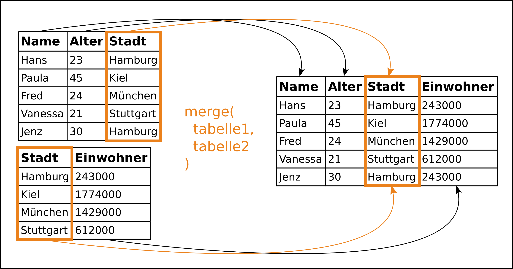
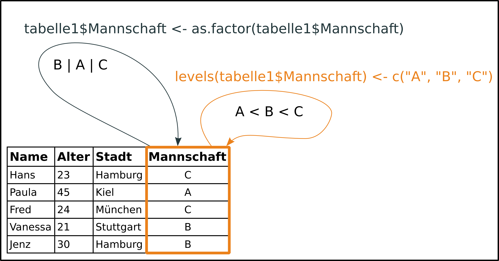
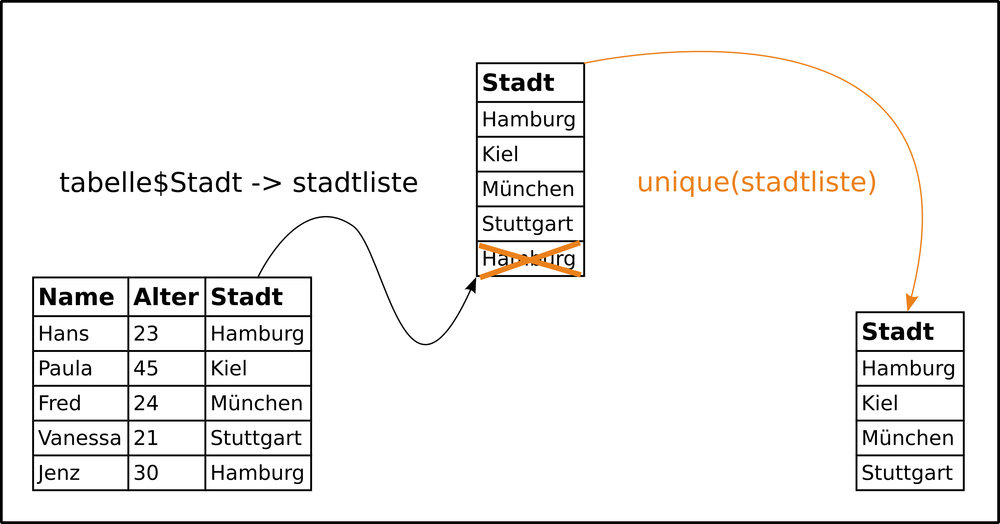
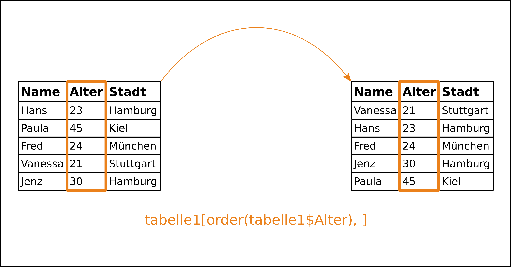

--- 
title: "Daten verarbeiten und vorbereiten" 
author: "Dirk
Seidensticker/Clemens Schmid" 
date: "6. Februar 2016" 
fontsize: 9pt 
output: 
  beamer_presentation: 
    toc: true 
    theme: "metropolis" 
    pandoc_args: [ 
      "--highlight-style=tango" 
    ] 
fig_caption: yes 
---

# Tidy-Data-Prinzip

# Daten verknüpfen (%in%, merge)

## Daten verknüpfen - Idee

**Zusammenführen von Informationen aus verschiedenen Tabellen.**



Vergleiche **Join-Operationen** in SQL (NATURAL JOIN, INNER JOIN, LEFT JOIN, RIGHT JOIN).  

Am Anfang steht oft die Frage, ob gemeinsame Merkmalsausprägungen vorhanden sind: **%in%** 

## base::merge()

> merge(**x**, **y**, **by** = intersect(names(x), names(y)),
      **by.x** = by, **by.y** = by, **all** = FALSE, **all.x** = all, **all.y** = all,
      sort = TRUE, suffixes = c(".x",".y"),
      incomparables = NULL, ...)

**Beschreibung**

Merge two data frames by common columns or row names, or do other versions of database join operations.

**Beispiel**

```{r} 
R <- data.frame(V1 = c(1,2,3), V2 = c(4,5,6), V3 = c("A","B","C"))
S <- data.frame(V4 = c(7,8,9), V5 = c(10,11,12), V6 = c("A","C","D"))

merge(x = R, y = S, by.x = "V3", by.y = "V6", all.x = TRUE)
```

## base::match()

> match(**x**, **table**, **nomatch** = NA_integer_, incomparables = NULL)
> x **%in%** table

**Beschreibung**

match returns a vector of the positions of (first) matches of its first argument in its second.

%in% is a more intuitive interface as a binary operator, which returns a logical vector indicating if there is a match or not for its left operand.

**Beispiel**

```{r} 
R <- data.frame(V1 = c(1,2,3), V2 = c(4,5,6), V3 = c("A","B","C"))
S <- data.frame(V4 = c(7,8,9), V5 = c(10,11,12), V6 = c("A","C","D"))

R$V3 %in% S$V6
```

# Kategorisierung und Rangfolgen (factor & levels)

## Kategorisierung und Rangfolgen - Idee

**Werte zu Klassen zusammen fassen und Klassen in eine Rangfolgen bringen** 



Klassifizierung und die Qualität von Klassen stecken nicht direkt in Daten - sie müssen klar zugewiesen werden.  
Insbesondere für Plots von Bedeutung. 

## base::factor()

> factor(**x** = character(), **levels**, **labels** = levels,
       exclude = NA, **ordered** = is.ordered(x), nmax = NA)

**Beschreibung**

The function factor is used to encode a vector as a factor (the terms ‘category’ and ‘enumerated type’ are also used for factors). If argument ordered is TRUE, the factor levels are assumed to be ordered.

**Beispiel**

```{r, results='hide', eval=FALSE} 
R <- data.frame(V1 = c(1.1,1.2,1.3), V2 = c(1,2,3))

R$V1 <- as.factor(R$V1)
```

## base::levels()

> levels(**x**)
> levels(**x**) <- value

**Beschreibung**

levels provides access to the levels attribute of a variable. The first form returns the value of the levels of its argument and the second sets the attribute.

**Beispiel**

```{r} 
R <- data.frame(V1 = c(1.1,1.2,1.3), V2 = c(1,2,3))

levels(R$V1) <- c(1.3,1.2,1.1)

R$V1
```

# Duplikate entfernen (unique & duplicated)

## Duplikate entfernen - Idee 

**Finden und entfernen doppelter Werte und Wertekombinationen**



Duplikate entfernen und Bandbreite einer Merkmalsausprägung erfassen: "Was gibt es überhaupt?" 

## base::unique()

> unique(**x**, incomparables = FALSE, **fromLast** = FALSE,
        nmax = NA, ...)

**Beschreibung**

...

**Beispiel**

```{r, results='hide', eval=FALSE} 
# 
```

## base::duplicated()

> duplicated(**x**, incomparables = FALSE,
           **fromLast** = FALSE, nmax = NA, ...)

**Beschreibung**

...

**Beispiel**

```{r, results='hide', eval=FALSE} 
# 
```

# Sortieren (sort & order)

## Sortieren - Idee 



## base::sort()

> sort(**x**, **decreasing** = FALSE, na.last = NA, ...)

**Beschreibung**

...

**Beispiel**

```{r, results='hide', eval=FALSE} 
# 
```

## base::order()

> order(**...**, na.last = TRUE, **decreasing** = FALSE)

**Beschreibung**

...

**Beispiel**

```{r, results='hide', eval=FALSE} 
# 
```

# Gruppieren und Gruppenoperationen (aggregate & group_by & summarise)

## Gruppieren und Gruppenoperationen - Idee 


## stats::aggregate()

> aggregate(**x**, **by**, **FUN**, ..., simplify = TRUE)

**Beschreibung**

...

**Beispiel**

```{r, results='hide', eval=FALSE} 
# 
``` 

## dplyr::group_by()

> group_by(**.data**, **...**, add = FALSE)

**Beschreibung**

...

**Beispiel**

```{r, results='hide', eval=FALSE} 
# 
``` 

## dplyr::summarise()

> summarise(**.data**, **...**)

**Beschreibung**

...

**Beispiel**

```{r, results='hide', eval=FALSE} 
# 
``` 

# Pivotieren (*apply & dcast)

# Datenanordnung - wide to long und long to wide (melt)

# Filtern (subset & filter)